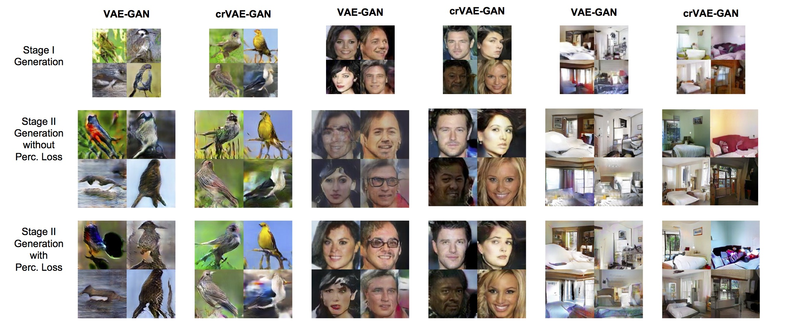

# Channel-Recurrent VAE for Image Modeling [[pdf](http://www-personal.umich.edu/~shangw/wacv18_main.pdf)][[supplementary materials](http://www-personal.umich.edu/~shangw/wacv18_supplementary_material.pdf)]
## Prerequisites
  - Linux, NVIDIA GPU + CUDA CuDNN 
  - Install torch dependencies from https://github.com/torch/distro
  - Install torch pacakge `cudnn`
```bash
luarocks install cudnn
```
  - Install the **batchDisc** branch of the git repo [stnbhwd](https://github.com/qassemoquab/stnbhwd/tree/batchDisc), as we need the batch discrimination layer. 

## Dataset
  - We provide code to train Birds dataset. The processed t7 files can be downloaded from [here](https://surfdrive.surf.nl/files/index.php/s/BOhGIKNjV14igmQ).
  - We also provide code to conduct ablation studies on MNIST. The MNIST files (both binary and dynamic) can be downloaded from [here](https://surfdrive.surf.nl/files/index.php/s/BOhGIKNjV14igmQ).

## Training 
  - To train Birds with baseline VAE-GAN, 
```bash
th main.lua -data /path/to/Birds/ -save /path/to/checkpoints/ -alpha 0.0002 -beta 0.05 -LR 0.0003 -eps 1e-6 -mom 0.9 -step 60 -manualSeed 1196
``` 
  - To train Birds with channel-recurrent VAE-GAN,
```bash
th main.lua -data /path/to/Birds/ -save /path/to/checkpoints/ -alpha1 0.0003 -alpha2 0.0002 -beta 0.0125 -LR 0.0003 -kappa 0.02 -latentType lstm -eps 1e-6 -mom 0.9 -step 60 -manualSeed 96
```
  - To train MNIST with VAE, 
```bash
th main_mnist.lua -LR 0.0003 -alpha 0.001 -latentType baseline -dataset mnist_28x28 -baseChannels 32 -nEpochs 200 -eps 1e-5 -mom 0.1 -step 50 -save /path/to/save/ -dynamicMNIST /path/to/dynamics/mnist/ -binaryMNIST /path/to/binary/mnist/
```
  - To train MNIST with convolutional VAE, 
```bash
th main_mnist.lua -LR 0.0003 -alpha 0.001 -latentType conv -dataset mnist_28x28 -baseChannels 32 -nEpochs 200 -eps 1e-5 -mom 0.1 -step 50 -save /path/to/save/ -dynamicMNIST /path/to/dynamics/mnist/ -binaryMNIST /path/to/binary/mnist/
```
  - To train MNIST with channel-recurrent VAE,
```bash
th main_mnist.lua -LR 0.003 -timeStep 8 -alpha 0.001 -latentType lstm -dataset mnist_28x28 -baseChannels 32 -nEpochs 200 -eps 1e-5 -mom 0.1 -step 50 -save /path/to/save/ -dynamicMNIST /path/to/dynamics/mnist/ -binaryMNIST /path/to/binayr/mnist/
```

## Pretrained Models
We provide pretrained models for Birds, CelebA, LSUN bedrooms, which can be downloaded from [here](https://surfdrive.surf.nl/files/index.php/s/BOhGIKNjV14igmQ) for others to perform quantitative evaluations such as in terms of inception scores, human preferences and etc. We also provide a script `generate_images.lua` to generate individual images from the pretrained models. This script has a lot of hardcoded components targeting at our models; for the same reason, please maintain the model names since they are parsed inside the script to extract model information. Here we present selected samples from the pretrained models. 



 - The Stage1 models are named in the format of `DATASET_Stage1_MODELTYPE.t7`; for example, `birds_Stage1_crvae.t7` refers to the crVAE-GAN model trained on 64x64 Birds images. To generate (`nSamples` is the number of generations), 
```
nSamples=500 modelFile=birds_Stage1_crvae.t7 modelDir=/path/to/pretrained/ saveDir=/path/to/save/ th generate_images.lua
```
 - To generate Stage2 images-128x128 for Birds and CelebA, 224x224 for LSUN bedrooms-the Stage1 models are necessary to have. In addition, Birds and CelebA require 2 GPUs and LSUN bedrooms 3 GPUs. The Stage2 models trained with perceptual loss are named in the format of `DATASET_Stage2_MODELTYPE_perc.t7`, without `DATASET_Stage2_MODELTYPE.t7`. For example, `birds_Stage2_crvae_perc.t7` refers to the Stage2 model trained on top of crVAE-GAN Stage1 model for Birds with perceptual loss. To generate, 
```
nSamples=500 modelFile=birds_Stage2_crvae_perc.t7 modelDir=/path/to/pretrained/ saveDir=/path/to/save/ th generate_images.lua
```

## Citation
If you find our code useful, please cite our paper:
```
@inproceedings{shang2017channel,
  title={Channel-Recurrent Autoencodering for Image Modeling},
  author={Shang, Wenling and Sohn, Kihyuk and Tian, Yuandong},
  booktitle={WACV},
  year={2018}
}
```
If you use the Birds data, please also cite the following papers
```
@article{wah2011caltech,
  title={The caltech-ucsd birds-200-2011 dataset},
  author={Wah, Catherine and Branson, Steve and Welinder, Peter and Perona, Pietro and Belongie, Serge},
  year={2011},
  publisher={California Institute of Technology}
}
@inproceedings{van2015building,
  title={Building a bird recognition app and large scale dataset with citizen scientists: The fine print in fine-grained dataset collection},
  author={Van Horn, Grant and Branson, Steve and Farrell, Ryan and Haber, Scott and Barry, Jessie and Ipeirotis, Panos and Perona, Pietro and Belongie, Serge},
  booktitle={Proceedings of the IEEE Conference on Computer Vision and Pattern Recognition},
  pages={595--604},
  year={2015}
}
@inproceedings{berg2014birdsnap,
  title={Birdsnap: Large-scale fine-grained visual categorization of birds},
  author={Berg, Thomas and Liu, Jiongxin and Woo Lee, Seung and Alexander, Michelle L and Jacobs, David W and Belhumeur, Peter N},
  booktitle={Proceedings of the IEEE Conference on Computer Vision and Pattern Recognition},
  pages={2011--2018},
  year={2014}
}
```
If you use the dynamic MNIST dataset, please also cite
```
@article{lecun1998mnist,
  title={The MNIST database of handwritten digits},
  author={LeCun, Yann},
  journal={http://yann. lecun. com/exdb/mnist/}
}
```
If you use the static MNIST datset, please also cite
```
@article{uria2016neural,
  title={Neural autoregressive distribution estimation},
  author={Uria, Benigno and C{\^o}t{\'e}, Marc-Alexandre and Gregor, Karol and Murray, Iain and Larochelle, Hugo},
  journal={Journal of Machine Learning Research},
  volume={17},
  number={205},
  pages={1--37},
  year={2016}
}
```

## Acknowledgments
Torch is a **fantastic framework** for deep learning research, which allows fast prototyping and easy manipulation of gradient propogations. We would like to thank the amazing Torch developers and the community. Our implementation has especially been benefited from the following excellent repositories:
 - Variational Autoencoders: https://github.com/y0ast/VAE-Torch
 - Spatial Transformer Network: https://github.com/qassemoquab/stnbhwd
 - StackGAN: https://github.com/hanzhanggit/StackGAN
 - facebook.resnet.torch: https://github.com/facebook/fb.resnet.torch
 - DCGAN: https://github.com/soumith/dcgan.torch
 - Generating Faces with Torch: https://github.com/skaae/torch-gan
 - Attr2Img: https://github.com/xcyan/eccv16_attr2img
 - CIFAR10: https://github.com/szagoruyko/cifar.torch  
